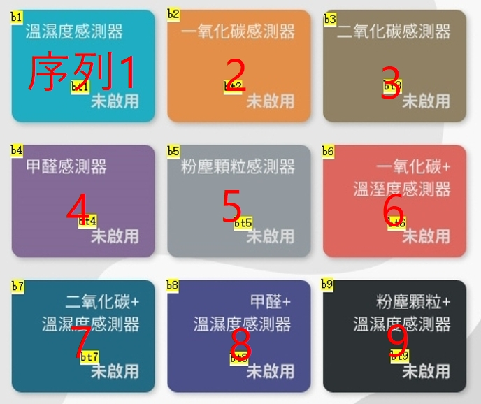

# Topic Format

>[!TIP]
>
>"訊息分類/序列/感測器類型/第幾顆"

# 範例一 : 溫濕度 (序列1)
#### 第1顆
1. "cvilux/1/temp/1"
2. "cvilux/1/humi/1"
#### 第2顆
1. "cvilux/1/temp/2"
2. "cvilux/1/humi/2"

# 範例二 : 粉塵 + 溫濕度 (序列9)
#### 第1顆
1. "cvilux/9/pm1_0/1" 
2. "cvilux/9/pm2_5/1"
3. "cvilux/9/pm10/1"
4. "cvilux/9/temp/1"
5. "cvilux/9/humi/1"
#### 第2顆
1. "cvilux/9/pm1_0/2"
2. "cvilux/9/pm2_5/2"
3. "cvilux/9/pm10/2"
4. "cvilux/9/temp/2"
5. "cvilux/9/humi/2"